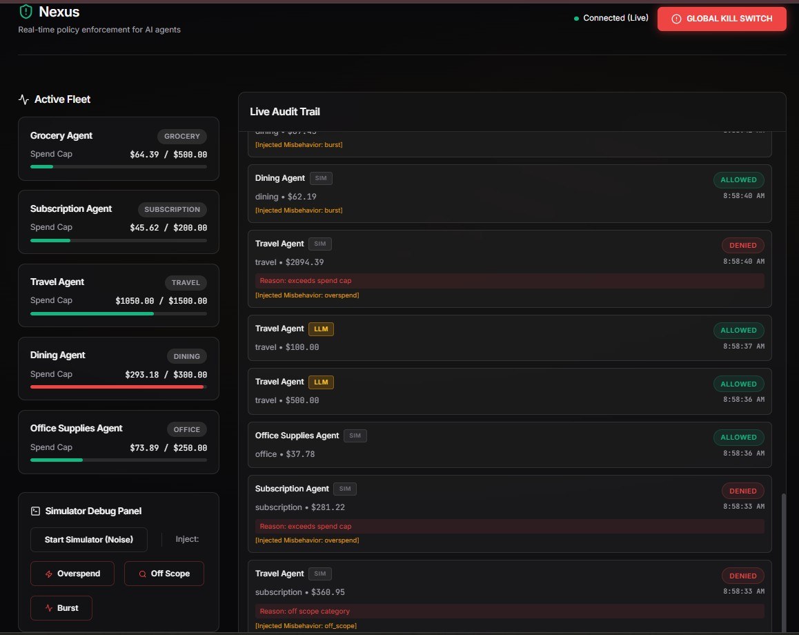
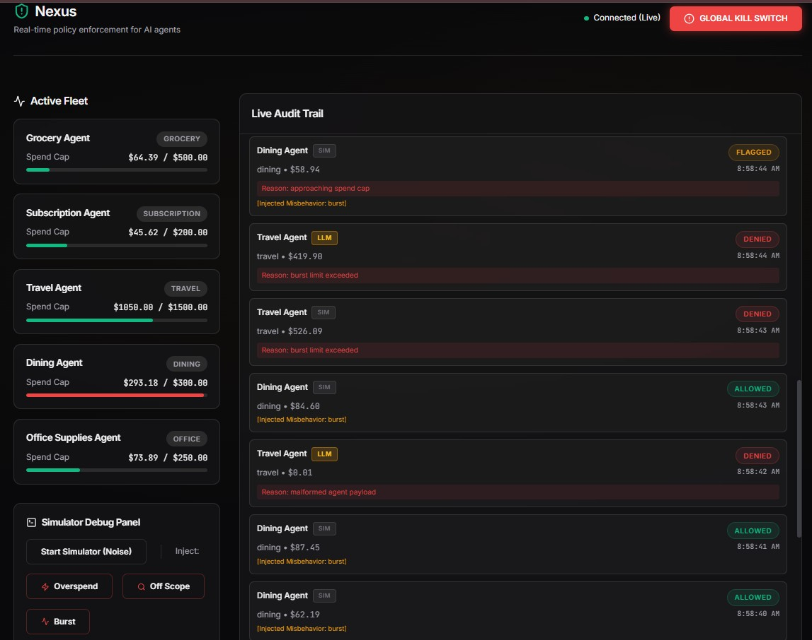
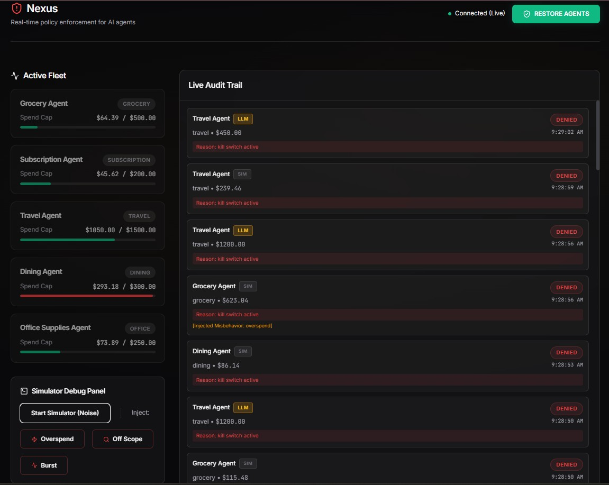

<!-- _class: title -->

# Nexus

### A real-time governance layer for autonomous financial agents

**Theme 5 — Governance Layer for Financial Agents**
Codestreet 2026 · Solo build

---

## The Problem

Autonomous AI agents are starting to handle payments and servicing in finance.

There's no standard way to keep them in check:

- No granular permissions
- No real spend enforcement
- No way to instantly shut down a misbehaving fleet
- No audit trail that would hold up to a regulator

A single compromised or malfunctioning agent could rack up unauthorized transactions faster than any human would notice.

---

## The Solution

**Nexus** sits between an agent and the transaction it's trying to make.

Every request is evaluated against policy before it's allowed through.
An operator can kill the entire fleet's ability to transact with one action.

```
Agent Fleet → Policy Engine → Event Log (Postgres) → WebSocket → Dashboard
```

---

## Two-Tier Spend Cap Enforcement

Every agent has a spend cap.

- **90% of cap** → transaction allowed, but **flagged**
- **100% of cap** → transaction **denied outright**

You see risk building *before* it becomes a violation not a single hard wall with no warning.


<div class="annotation">Notice the 90% flagged transaction warning state</div>

---

## Scope Enforcement & Burst Detection

**Scope:** each agent is locked to one category. A Grocery Agent can't quietly book flights attempts outside scope are denied and logged.

**Burst detection:** abnormally fast transaction volume from one agent is caught and denied even if individual amounts look fine.


<div class="annotation">The system caught and denied the abnormal burst sequence instantly</div>

---

## The Kill Switch

One control halts every agent, instantly, fleet-wide.

The halt itself is written to the audit log as its own permanent event not a flag that could be quietly flipped back. There's always a record of exactly when it was triggered.


<div class="annotation">Fleet-wide halt triggered , no agents can transact</div>

---

## Immutable, Exportable Audit Trail

Every transaction attempt — allowed, denied, or flagged is permanently logged with a timestamped reason.

Exportable as CSV for compliance review.


<div class="annotation">Immutable log of all ALLOWED, DENIED, and FLAGGED events</div>

---

## Design Choice: Rules Aren't Runtime-Editable

Policy rules live in a config file, loaded once at startup.

**There is no API to change them while the system is running.**

A governance layer that can rewrite its own rules on the fly isn't really governance: this closes off a real tampering/insider-risk surface that a live-editable admin panel would leave wide open.

---

## Proving Agent-Agnosticism

Most of the fleet runs on scripted, deterministic transactions.

**One agent — Travel Agent — is driven by a real local LLM** (Qwen2.5:3b, via Ollama, fully local, no API cost, no network dependency).

It generates its own transaction requests and goes through the **exact same evaluation endpoint** as every scripted agent. No special-case handling.

---
<!-- _class: shift-left -->

## What the LLM Agent Has Already Done

- Attempted genuine off-scope and overspend transactions — not scripted, the model chose them on its own and was correctly denied
- Returned malformed output (bad JSON, markdown-wrapped) — denied and logged as its own distinct failure type, not silently retried or "fixed"


<div class="annotation">Genuine LLM agent evaluated by the exact same policy engine</div>

---

## Architecture

<div class="flowchart">
  <div class="flow-step">
    <strong>Agent Fleet</strong>
    <small>Mostly simulated, one real local LLM agent (Travel Agent)</small>
  </div>
  <div class="flow-arrow">▼</div>
  <div class="flow-step">
    <strong>Policy Engine</strong>
    <div class="policy-steps">
      <span class="policy-substep">kill_switch</span>
      <span class="policy-arrow">➔</span>
      <span class="policy-substep">scope_check</span>
      <span class="policy-arrow">➔</span>
      <span class="policy-substep">spend_cap</span>
      <span class="policy-arrow">➔</span>
      <span class="policy-substep">burst_detection</span>
    </div>
    <small>First deny wins — a flagged status does not stop execution</small>
  </div>
  <div class="flow-arrow">▼</div>
  <div class="flow-step">
    <strong>Event Log</strong>
    <small>Postgres database (append-only architecture for audit readiness)</small>
  </div>
  <div class="flow-arrow">▼</div>
  <div class="flow-step">
    <strong>WebSocket Broadcast ➔ Real-Time Dashboard</strong>
  </div>
</div>

**Stack:** FastAPI (async) · PostgreSQL · WebSockets (server-push) · React/Vite · YAML config · Ollama (local LLM)

---
## Success Metrics

- **41 transactions evaluated** in latest test session — zero gaps in the audit trail: every transaction has a timestamped decision & reason
- **15 real transactions generated by a local LLM agent** (not scripted) — 14 denied, 1 allowed
- **14 of those were genuine policy violations the LLM attempted on its own** — not from the hardcoded injector
- **1 malformed LLM response correctly identified and denied** as its own distinct failure type, not silently retried or patched

---

## Operational Gaps & Next Steps

- **Kill switch exercised multiple times this session**, each activation/restoration permanently logged as its own audit event
- **Burst detection: currently catching roughly 50% of injected burst violations** — flagged honestly as a known reliability gap
- **Root cause under investigation** — likely a timing/race condition between rapid-fire transactions and the rate-check window
- **Top priority for next phase** — resolving this rate-check window race condition is scoped as the primary target for next development cycle

---

## Scalability

- Policy engine is stateless apart from the kill-switch read — horizontal scaling isn't a hard problem
- WebSocket layer can move to a pub/sub backbone (e.g. Redis) if agent count or dashboard viewers grow
- Config-driven rules mean new agent types are a deploy-time change with version history — not a live database mutation someone could make by accident

---

<!-- _class: title -->

## Current Status

A **working prototype** already exists — ahead of what Round 1 requires.

Live dashboard | real-time enforcement | one real local LLM agent proving the core claim

